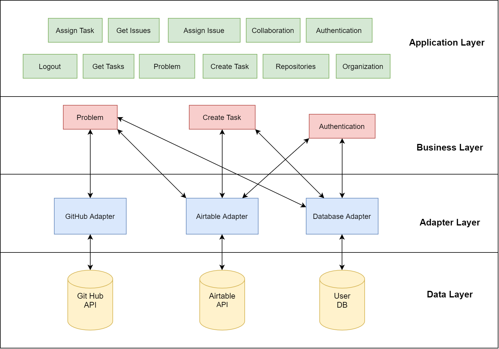

# eagle-bot-api

The project is up and running (_I hope_) [here] (https://eagle-bot-api.herokuapp.com/)

## Project Structure



## Install
```javascript
git clone https://github.com/lucagump/eagle-cms.git
npm install
```

## Config

Clone the repository, install the module and  place the .env file with tokens and variables. 

## Run

```javascript
npm run dev
```

## Postman Document

The complete generated document of the API is available [here] (https://documenter.getpostman.com/view/3504740/TVCjx5xT#33c906b0-350f-4e19-a0e6-09d6a9aab648)

## Report

