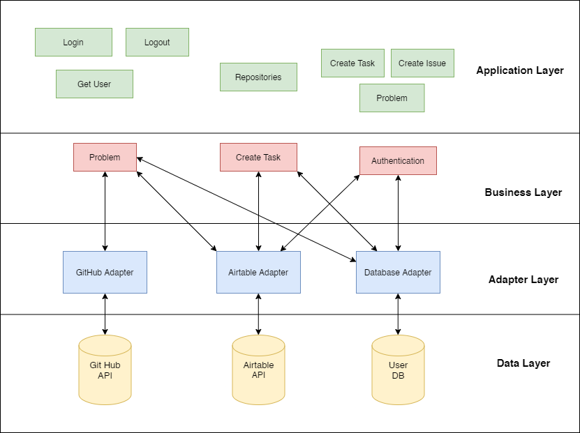

# eagle-bot-api

Telegram Bot developed for E-Agle Trento Racing Team to manage tasks and issues on GitHub/AirTable. The project is up and running (_hoping_) [here](https://eagle-bot-api.herokuapp.com/).

## The Bot

To try it, chat with the Bot! [TelegramBot](https://t.me/eagle_git_bot)

## Project Structure


## Install
```javascript
git clone https://github.com/lucagump/eagle-bot-api.git
npm install
```

## Config

Clone the repository, install the module and place the .env file with tokens and variables. 

## Run

```javascript
npm run dev
```

## Postman Document

The complete generated document of the API is available [here](https://documenter.getpostman.com/view/3504740/TVCjx5xT#33c906b0-350f-4e19-a0e6-09d6a9aab648).

## Report



The [report ](https://github.com/lucagump/eagle-bot-api/blob/master/documents/report-sde.pdf) is in the /documents folder  

